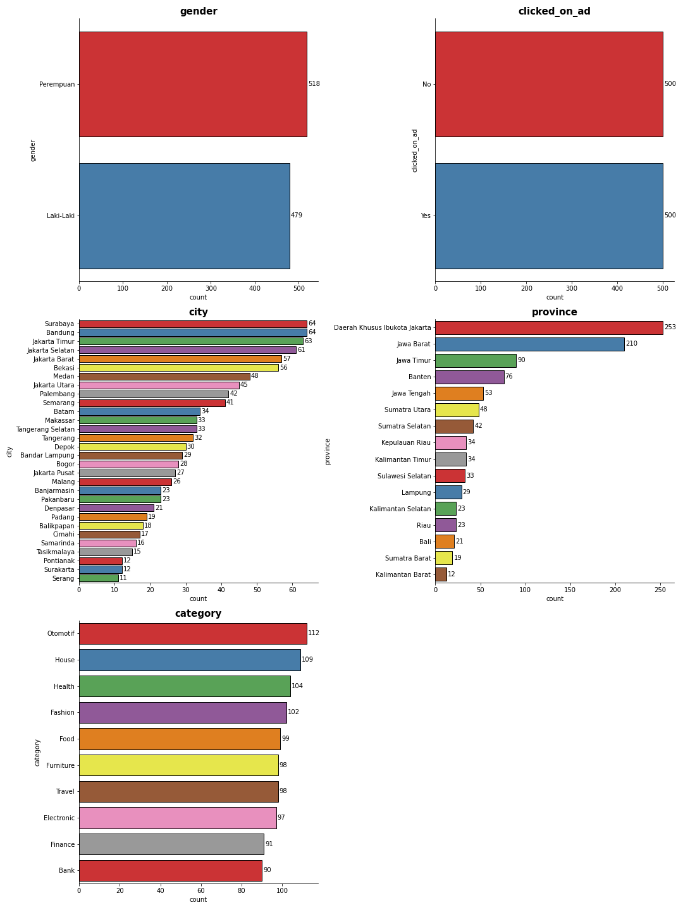
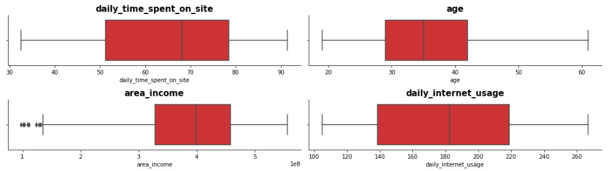
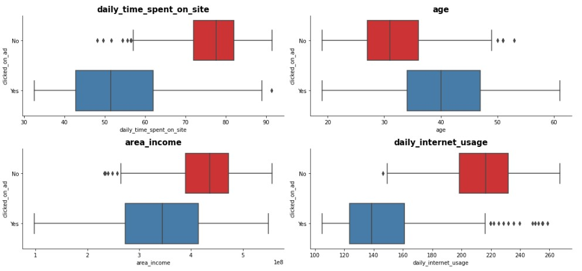
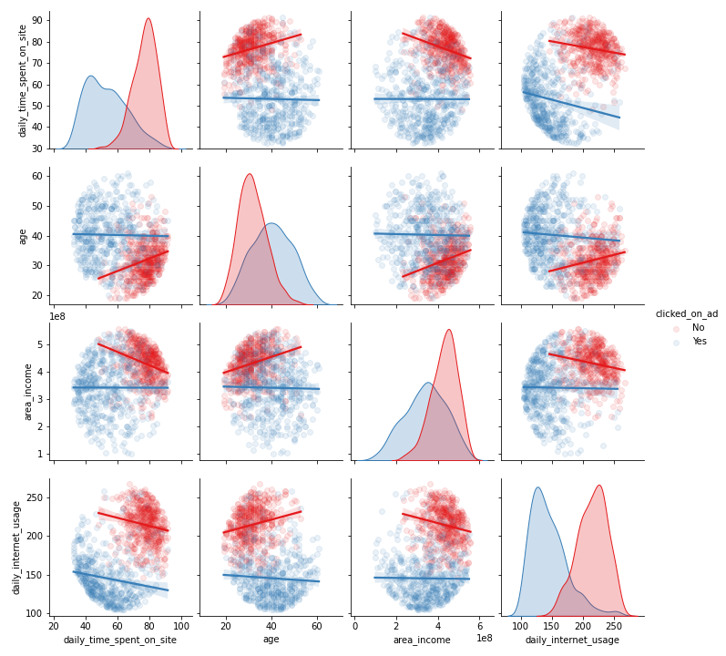
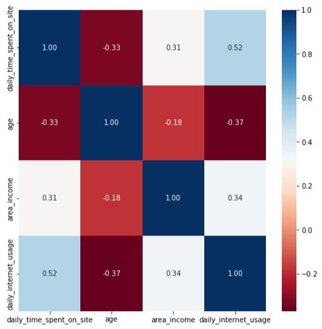
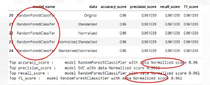
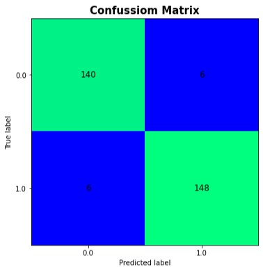
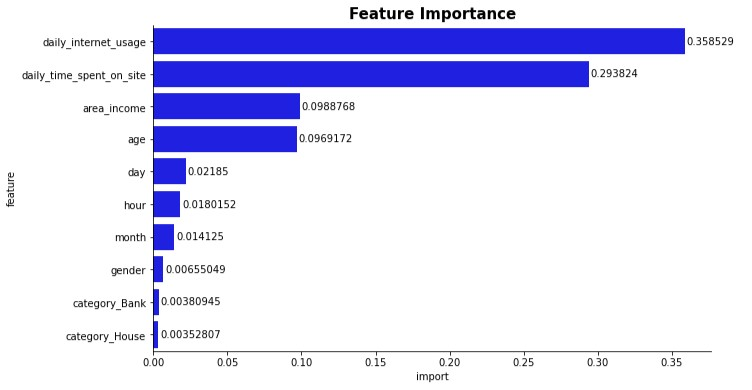

# About the project
A company in Indonesia seeks to assess the effectiveness of an advertisement they have aired. This is crucial for the company to gauge the extent of reach their marketed ad has achieved, thereby attracting customers to view the ad.

By processing historical advertising data and uncovering insights and patterns that emerge, it can aid the company in defining marketing targets. The focus of this case is on creating a machine learning classification model that serves to identify the appropriate target customers.

# Objective
- Conduct analysis of advertisement data.
- Create machine learning model to predict which customer will click ads.
- Experiment on data transformation combination.

# Research Question
 - Is there any interesting pattern on advertising data?
 - What model will suit with this problem?
 - Does data transformation affect model performance?

# Hypotesis
 - There will be some different for each features, each users have their own interest in ads.
 - Need to try some model to get which model suits with this problem.
 - There may some differences in model performance cause model have it is own alogarithm to do prediction.

 # Data
 Data were a website traffic from a company from 2016.

# EDA
## Univariate Analysis

The distribution of customer gender is almost balanced, with the number of females being 518 and males being 479. The majority of customers originate from DKI Jakarta and West Java. The distribution of categories does not differ significantly, with the highest category being automotive with a count of 112 and the lowest being banking with a count of 90.

The majority of Daily Time Spent on Site falls within the range of 51.27 - 78.46 minutes, and Daily Internet Usage falls within the range of 138.7 - 218.8 minutes. Customers span an age range of 19 - 61 years and have an income range of 97.9 - 556.3 million.

## Multivariate Analysis

Customers who clicked on ads have a low Daily Time Spent on Site, falling within the range of 42 - 62 minutes, and a Daily Internet Usage within the range of 123 - 161 minutes. These customers who clicked ads are aged between 34 - 47 years with an income range of 273.5 - 414.6 million.

The distribution between clicked ads appears to be quite distinct. Data with 'Yes' for clicked ads tends to lack correlations among the features. Data with 'No' for clicked ads shows weak correlations among the features.

In the correlation plot of the entire dataset, the features with the highest correlation are Daily Internet Usage and Daily Time Spent on Site, with a correlation value of 0.52. The lowest correlation is observed between Age and Area Income, with a correlation value of -0.18.

 # Data Preprocessing
 There is some missing values in dataset, we try to fill with imputation KNNImputer. For categorical columns we do label encoding for gender and target. We perform some scaler normalization and /or standarization samples, to experiment the affect to model performance.

# Modeling
We trial some models to get most suits model to this problem and we use metric accuracy, precision, recall, and f1 score to define model performance. 

The model with the highest metrics is the RFClassifier using the normalized dataset. From the data, it can be observed that scaling the data did not have a significant impact on the modeling results.

Daily internet usage dan daily time spent on site memiliki importance yang tinggi terhadap model.
Feature selanjutnya yang memiliki importance yang cukup tinggi adalah area_income dan age, dan kemudian pada feature waku (day, hour dan month).

# Summary
There is some interesting insight in age, income, daily internet usage and time spent on site to clicked on ads, each features have it is own distribution. The best model for this problem is Random Forest Classifier with data that have transform with normalization scaler.

# Recommendation

Conducting target marketing on customers with the following characteristics:
- Daily Internet Usage within the range of 123.45 - 161.18 minutes
- Daily Time Spent on Site within the range of 42.92 - 62.22 minutes
- Area Income within the range of 273.9 - 414.6 million IDR per year
- Age within the range of 34.0 - 47.0 years